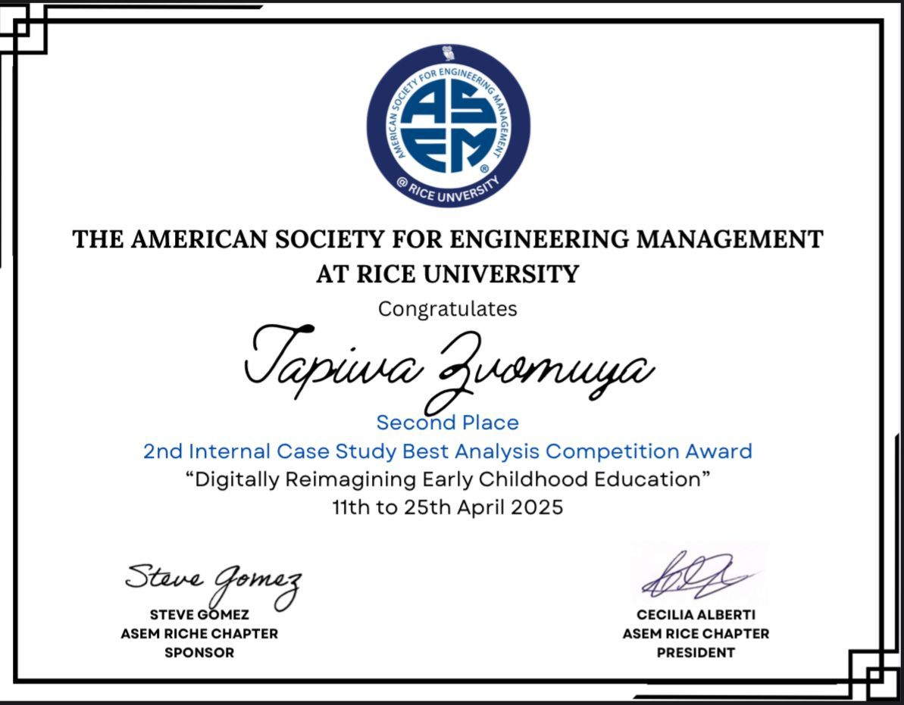
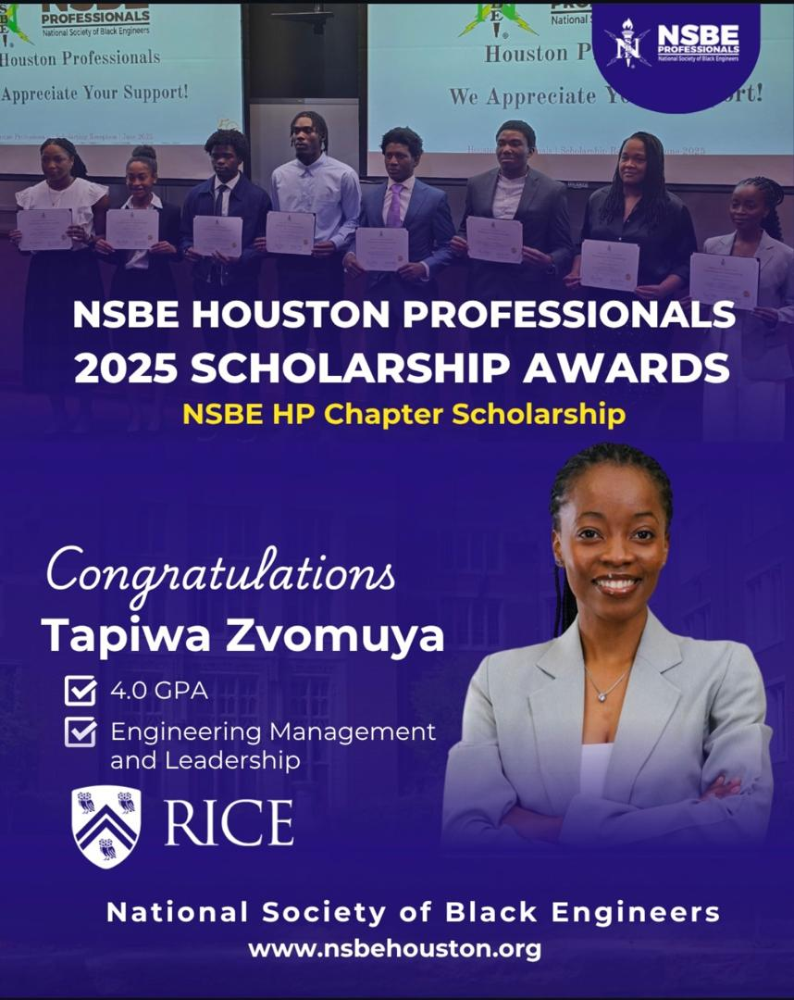

# TapiwaZvomuya.github.io
## Engineering Management & Leadership specializing in Energy Transition and Sustainability

### 🔧👩‍💻 Get to know me 
- From **Zimbabwe**, currently based in **Houston, TX**  
- Interested in **energy transition**, **circular economy**, and **smart manufacturing**  
- Experienced in **data science**, **polymer engineering**, and **machine learning applications** in materials processing  
- Former **Quality Control Manager** at **Driptech Irrigation**, leading ISO 9001:2015 initiatives and R&D expansion  
- **Teaching Assistant** at Rice University for *Data Science for Engineers* 

### Education
*Master of Engineering Management and Leadership, Energy Transition and Sustainability*
*Bachelor of Technology in Polymer Technology and Engineering*

### Projects
1. Leveraging Data Science to Predict and Prevent Manufacturing Defects - Created a data-driven Machine Learning model to predict and prevent manufacturing defects using KMeans clustering.

   

3. Defect detection Robotic arm - Designed and fabricated a robotic arm for wall thickness variation detection in Polyethylene Terephthalate (PET) bottles in a 
PET blow molding plant based on material ultrasonic waves absorption.

   (a) Mechanical System design overview

   (b) Robotic arm and sensor system

   (c) Process layout flow-diagram

   (d) Sensor Calibration Results

  a)    b)  

  c)          d)  

### 💼Work Experience
• Student Co-Chair, Rice Global Forum (RGF) 

• Teaching Assistant, Data Science for Engineers (RCEL)

• Assistant Coordinator, Rice Elite Tech Summer Camp (RCEL)

• Quality Control Manager (DripTech Irrigation) 

• R&D Lead, PVC Product Line Expansion – designed new in-line processing systems for pipes up to 1000mm diameter  
 

### 🏆Regional and International Awards
• 2nd Runner-up ASEM Case Study Competition

       
 
• NSBE Houston Professionals Scholarship for Academic Excellence

   
  
• Vice Chancellor's Prize for the Best Graduating Student in Polymer Technology and Engineering 

• HIT Book Prize for the Best Capstone Design Project                      

• UNESCO/ ECSA (Engineering Council of South Africa) best SDG 9 poster competition project in Africa 

### 📫 Let’s Connect  
- 💼 [LinkedIn](https://www.linkedin.com/in/tapiwazvomuya/)  
- ✉️ Email: [tz52@rice.edu](mailto:tz52@rice.edu)  
- 🌐 [GitHub Portfolio]:(https://github.com/tapiwazvomuya)](https://tapiwa-zvomuya.github.io/TapiwaZvomuya.github.io/)

